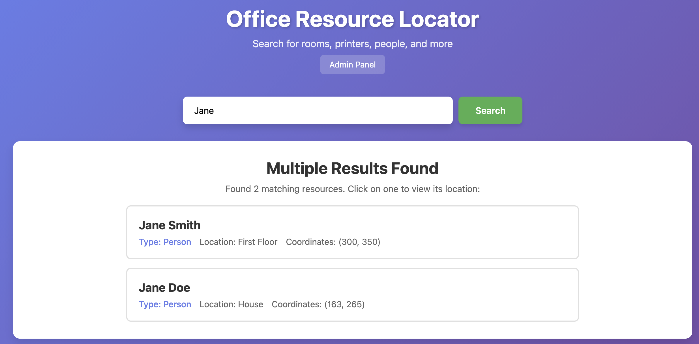
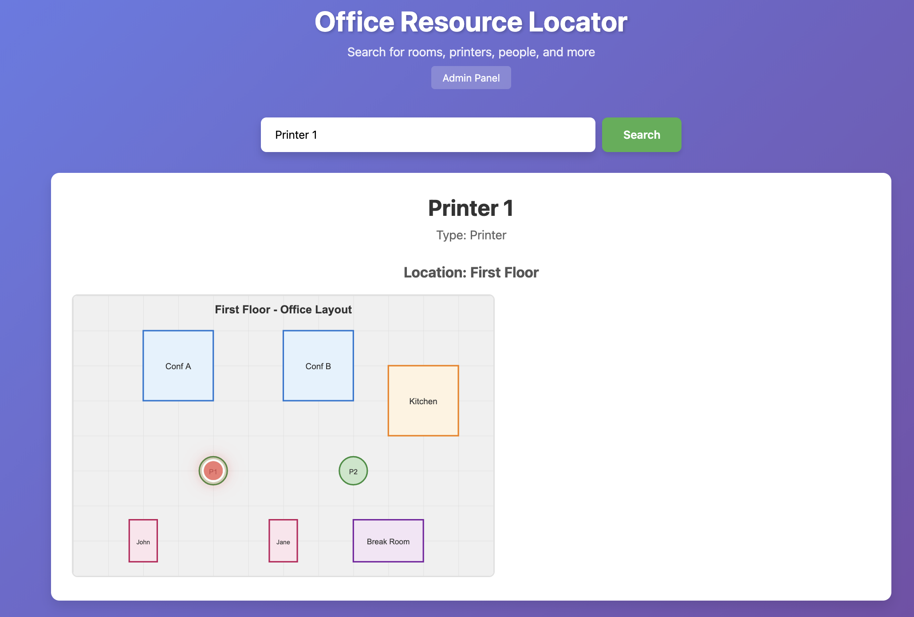
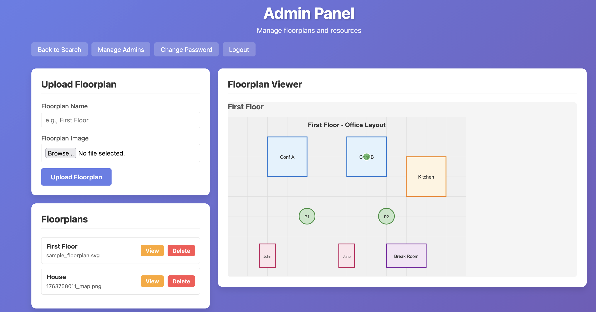
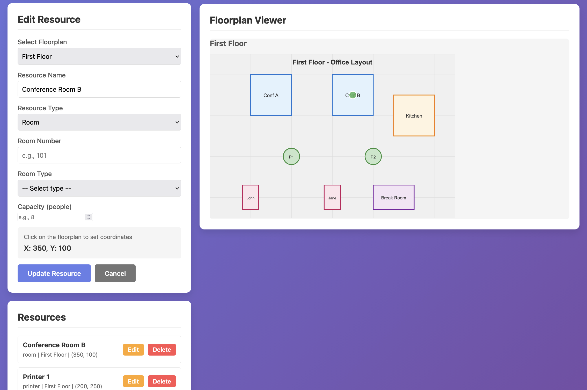

# Office Resource Locator

<!--
NOTE: Keep this README up to date with all features and project structure changes.
Last updated: 2024-11 with authentication system and comprehensive security features.
-->

A Flask web application for locating office resources (people, printers, rooms, etc.) on interactive floorplans. Perfect for small organizations that need a simple way to help employees find resources within their office space.


## Features

### For Users
- **Search Interface**: Modern, intuitive web UI for searching resources by name
- **Interactive Floorplans**: View resource locations on visual floorplans with animated cursor
- **Multiple Results**: Smart handling when multiple resources match your search
- **Responsive Design**: Works on desktop and mobile devices

### For Administrators
- **Secure Authentication**: Login required with admin privileges
- **Admin Panel**: Comprehensive management interface at `/admin`
- **Upload Floorplans**: Drag and drop floorplan images (PNG, JPG, JPEG, GIF)
- **Interactive Resource Placement**: Click on floorplans to set resource coordinates
- **Full CRUD Operations**: Create, read, update, and delete resources and floorplans
- **Real-time Preview**: See resources on floorplans as you place them
- **User Management**: Create, delete, and reset passwords for admin users
- **Resource Types**: Support for rooms, printers, people, and bathrooms with type-specific metadata
- **Password Security**: Strong password requirements with mandatory change on first login

### Technical Features
- RESTful JSON API
- Admin authentication with Flask-Login
- CSRF protection for all state-changing operations
- XSS protection with HTML escaping
- Secure session cookies (HttpOnly, Secure, SameSite)
- Environment variable configuration
- Image content validation using Pillow
- File size limits (16MB) and secure file handling
- SQLite database with SQLAlchemy ORM
- Database migrations with Flask-Migrate (timestamp-based)
- Application factory pattern for testability
- Comprehensive test suite with 81% branch coverage

## Screenshots

### User Search Interface
Search for any resource and see its location on the floorplan with an animated cursor.



### Resource View with Floorplan
View the selected resource on the floorplan with an animated cursor showing the exact location.



### Admin Panel - Top
Upload floorplans, manage resources, and view all your floorplans and resources.



### Admin Panel - Bottom
Interactive floorplan view showing all resources with coordinates and management options.



## Quick Start

### Prerequisites

- Python 3.14 or higher
- [uv](https://github.com/astral-sh/uv) (recommended) or pip

### Installation

1. **Clone the repository**
```bash
git clone <your-repo-url>
cd office-resource-locator
```

2. **Install dependencies**

Using uv (recommended):
```bash
uv sync
```

Using pip:
```bash
pip install -r requirements.txt
# For development (includes testing and linting tools):
pip install -r requirements-dev.txt
```

3. **Set up environment variables (recommended for production)**

Create a `.env` file (use `.env.example` as a template):
```bash
cp .env.example .env
```

Edit `.env` and set a secure SECRET_KEY:
```bash
# Generate a secure secret key
python -c "import secrets; print(secrets.token_hex(32))"
```

4. **Initialize the database**

Using uv:
```bash
uv run flask db upgrade
```

Using pip:
```bash
flask db upgrade
```

5. **Run the application**
```bash
uv run python run.py  # or: python run.py
```

On first run, if no admin users exist, a default admin user will be created automatically:
- **Username**: `admin`
- **Password**: `Admin123!@#`
- You'll be prompted to change this password on first login

6. **Open your browser**
- User Interface: http://localhost:8000
- Admin Login: http://localhost:8000/login
- Admin Panel: http://localhost:8000/admin (after login)

## Project Structure

```
.
├── app/
│   ├── __init__.py           # Application factory with security configuration
│   ├── models.py             # Database models (User, Floorplan, Resource)
│   ├── routes.py             # Main API routes and view handlers
│   ├── auth_routes.py        # Authentication routes (login, logout, password management)
│   ├── static/
│   │   ├── css/              # Stylesheets for user and admin UIs
│   │   ├── js/               # JavaScript with XSS protection
│   │   │   ├── app.js        # User search interface logic
│   │   │   └── admin.js      # Admin panel interactivity
│   │   └── floorplans/       # Uploaded floorplan images
│   └── templates/
│       ├── base.html         # Base template with Jinja2 inheritance
│       ├── index.html        # User search interface
│       ├── admin.html        # Admin management panel
│       ├── login.html        # Admin login page
│       ├── change_password.html  # Password change interface
│       └── manage_users.html # User management interface
├── migrations/               # Database migration scripts (timestamp-based)
├── tests/
│   ├── conftest.py           # Pytest fixtures and configuration
│   ├── test_models.py        # Database model tests
│   ├── test_routes.py        # API endpoint tests
│   ├── test_auth_routes.py   # Authentication tests (50 tests)
│   └── test_security.py      # CSRF and security tests
├── run.py                    # Application entry point
├── .env.example              # Environment variable template
├── CLAUDE.md                 # Developer documentation
├── LICENSE.txt               # MIT License
└── pyproject.toml            # Project dependencies (uv/pip)
```

## Usage

### For Users

1. Go to http://localhost:8000
2. Enter a search term (e.g., "Conference Room", "John", "Printer")
3. If multiple matches are found, select the one you want
4. View the floorplan with an animated cursor showing the location

### For Administrators

1. **Login:**
   - Go to http://localhost:8000/login
   - Enter your admin username and password
   - If this is your first login, you'll be prompted to change your password

2. **Upload a Floorplan:**
   - Go to http://localhost:8000/admin
   - Enter a name (e.g., "First Floor")
   - Select an image file (PNG, JPG, JPEG, or GIF - max 16MB)
   - Click "Upload Floorplan"

3. **Add a Resource:**
   - Select a floorplan from the dropdown
   - Enter resource name and select type (room, printer, person, bathroom)
   - Enter type-specific details (e.g., room number, printer model, email)
   - Click on the floorplan image to set coordinates
   - Click "Create Resource"

4. **Edit a Resource:**
   - Click "Edit" on any resource
   - Update details and click on the floorplan to change position
   - Click "Update Resource"

5. **Delete:**
   - Click "Delete" on any resource or floorplan

6. **Manage Admin Users:** (from user management page)
   - Create new admin users with secure passwords
   - Reset passwords for existing users
   - Delete users (except yourself)

## API Endpoints

### Public Endpoints

#### Search
```http
GET /api/search?q=<query>
```
Returns all resources matching the query with their floorplan information.

**Response:**
```json
{
  "count": 2,
  "results": [
    {
      "resource": {
        "id": 1,
        "name": "Conference Room A",
        "type": "room",
        "x_coordinate": 150,
        "y_coordinate": 100,
        "floorplan_id": 1
      },
      "floorplan": {
        "id": 1,
        "name": "First Floor",
        "image_filename": "floor1.png"
      }
    }
  ]
}
```

### Admin Endpoints (Authentication Required)

All floorplan and resource endpoints require authentication. POST/PUT/DELETE operations also require valid CSRF tokens.

#### Authentication
- `POST /login` - Admin login
- `POST /logout` - Logout current user
- `GET /change-password` - Password change form
- `POST /change-password` - Update password
- `GET /admin/users` - List admin users
- `POST /admin/users/create` - Create new admin user
- `POST /admin/users/<id>/delete` - Delete admin user
- `POST /admin/users/<id>/reset-password` - Reset user password

#### Floorplans
- `GET /api/floorplans` - List all floorplans (requires authentication)
- `POST /api/floorplans` - Upload a new floorplan (multipart/form-data, validates image content)
- `GET /api/floorplans/<id>` - Get floorplan details (requires authentication)
- `PUT /api/floorplans/<id>` - Update floorplan
- `DELETE /api/floorplans/<id>` - Delete floorplan (cascades to resources)

#### Resources
- `GET /api/resources` - List all resources (requires authentication)
- `POST /api/resources` - Create a new resource with type-specific metadata
- `GET /api/resources/<id>` - Get resource details (requires authentication)
- `PUT /api/resources/<id>` - Update resource
- `DELETE /api/resources/<id>` - Delete resource

## Configuration

The application uses environment variables for configuration. Create a `.env` file based on `.env.example`:

```bash
# Flask Configuration
SECRET_KEY=your-secret-key-here-change-me-in-production
FLASK_ENV=development  # or production
FLASK_DEBUG=true       # Only set to true in development, NEVER in production
```

### Configuration Options

**SECRET_KEY** (required in production)
- Generate with: `python -c "import secrets; print(secrets.token_hex(32))"`
- Used for session encryption and CSRF tokens
- Defaults to development key if not set (insecure!)

**FLASK_ENV**
- `development` or `production`
- In production mode, secure session cookies are enabled

**FLASK_DEBUG**
- Set to `true` only in development
- Never enable debug mode in production

**Database**
- SQLite database stored in `app.db`
- Can be configured in `app/__init__.py` if needed:
  ```python
  app.config['SQLALCHEMY_DATABASE_URI'] = 'sqlite:///app.db'
  ```

## Database Management

### Using uv (recommended)

```bash
# Create a new migration after model changes
uv run flask db migrate -m "Description of changes"

# Apply migrations
uv run flask db upgrade

# Rollback
uv run flask db downgrade

# Show current version
uv run flask db current
```

### Using pip

```bash
# Install production dependencies
pip install -r requirements.txt

# Install development dependencies (testing, linting, etc.)
pip install -r requirements-dev.txt

# Run migration commands
flask db migrate -m "Description"
flask db upgrade

# Run the application
python run.py

# Run tests
pytest

# Run linting
ruff check app/ tests/ run.py
black app/ tests/ run.py
mypy app/
```

## Security

The application implements comprehensive security measures:

### Authentication & Authorization
- **Admin Authentication**: Flask-Login with session-based authentication
- **Password Requirements**: Minimum 10 characters with uppercase, lowercase, numbers, and special characters
- **Password Management**: Mandatory password change on first login, secure password reset
- **Admin-Only Access**: All management operations require admin privileges

### Session Security
- **Secure Cookies**: HttpOnly, Secure (in production), SameSite=Lax
- **Session Timeout**: 1-hour session lifetime
- **Environment-Based Secrets**: SECRET_KEY from environment variables

### Input Validation & Protection
- **CSRF Protection**: All state-changing operations require valid CSRF tokens
- **XSS Protection**: HTML escaping in JavaScript to prevent cross-site scripting
- **Open Redirect Protection**: URL validation for safe redirects
- **SQL Injection Protection**: SQLAlchemy ORM with parameterized queries

### File Upload Security
- **Content Validation**: Pillow-based image verification (not just extension checking)
- **File Size Limits**: 16MB maximum upload size
- **Allowed Formats**: PNG, JPEG, GIF only (SVG removed to prevent XSS)
- **Secure Filenames**: `secure_filename()` with timestamp prefixes

### Additional Security Measures
- **Timezone-Aware Timestamps**: Prevents timezone manipulation attacks
- **Debug Mode Control**: Environment-based, never enabled in production
- **Database Security**: Prepared statements via SQLAlchemy ORM

## Development

See [CLAUDE.md](CLAUDE.md) for detailed developer documentation, including:
- Application architecture
- Database schema
- Common commands
- API endpoint details

## Testing

The application includes comprehensive unit tests with pytest.

### Running Tests

```bash
# Run all tests
uv run pytest

# Run with verbose output
uv run pytest -v

# Run specific test file
uv run pytest tests/test_models.py

# Run specific test class
uv run pytest tests/test_routes.py::TestSearchAPI

# Run with coverage report
uv run pytest --cov=app --cov-report=term-missing
```

### Test Structure

```
tests/
├── conftest.py          # Pytest fixtures and configuration
├── test_models.py       # Database model tests (User, Floorplan, Resource)
├── test_routes.py       # API endpoint tests (search, floorplans, resources)
├── test_auth_routes.py  # Authentication tests (login, password, user management - 50 tests)
└── test_security.py     # CSRF protection tests
```

### Test Coverage

Current test coverage: **81% with branch coverage** (89 tests)

The test suite includes:
- **Model Tests**: Database operations, relationships, cascade deletes
- **Route Tests**: All API endpoints, CRUD operations, file uploads with authentication
- **Authentication Tests**: Login, logout, password changes, user management (50 comprehensive tests)
- **Security Tests**: CSRF protection, XSS prevention validation
- **Integration Tests**: End-to-end workflows with authentication

**Coverage Requirement**: Minimum 80% branch coverage must be maintained

### Writing New Tests

Tests use pytest fixtures defined in `conftest.py`:
- `app` - Flask application instance with test database
- `client` - Test client for making requests
- `admin_user` - Pre-created admin user for authentication testing
- `sample_floorplan` - Pre-created floorplan for testing
- `sample_resource` - Pre-created resource for testing
- `multiple_resources` - Multiple resources for search testing

Example test:
```python
def test_search_resource(client, sample_resource):
    """Test searching for a resource."""
    response = client.get('/api/search?q=Test Room')
    assert response.status_code == 200
    data = json.loads(response.data)
    assert data['count'] == 1
```

## Code Quality and Linting

The project uses modern Python linting and formatting tools to maintain code quality. All function definitions include type hints for improved code clarity and type safety.

### Tools

- **Ruff**: Fast Python linter (replaces flake8, pylint, isort, and more)
- **Black**: Opinionated code formatter for consistent style
- **Mypy**: Static type checker for catching type-related bugs
- **Type Hints**: Comprehensive type annotations on all function definitions

### Running Linters

```bash
# Lint code with ruff
uv run ruff check app/ tests/ run.py

# Auto-fix linting issues
uv run ruff check --fix app/ tests/ run.py

# Format code with black
uv run black app/ tests/ run.py

# Check formatting without changes
uv run black --check app/ tests/ run.py

# Type check with mypy
uv run mypy app/

# Run all checks together
uv run ruff check app/ tests/ run.py && uv run black --check app/ tests/ run.py && uv run mypy app/
```

### Configuration

All linting tools are configured in `pyproject.toml`:
- **Line length**: 100 characters
- **Target Python version**: 3.14
- **Ruff rules**: pycodestyle, pyflakes, isort, bugbear, comprehensions, pyupgrade
- **Mypy**: Configured for gradual typing with Flask extension support

### Pre-commit Workflow

Before committing code:
1. Run `uv run ruff check --fix app/ tests/ run.py` to fix linting issues
2. Run `uv run black app/ tests/ run.py` to format code
3. Run `uv run pytest` to ensure tests pass
4. Commit your changes


## License

This project is licensed under the MIT License - see the [LICENSE.txt](LICENSE.txt) file for details.

## Acknowledgments

- Built with Flask, SQLAlchemy, and Flask-WTF
- UI inspired by modern web design patterns
- Created to solve real office navigation challenges

## Support

If you encounter any issues or have questions:
- Open an issue on GitHub
- Check existing issues for solutions
- Review the documentation in [CLAUDE.md](CLAUDE.md)

---

Made with ❤️ for small organizations everywhere
